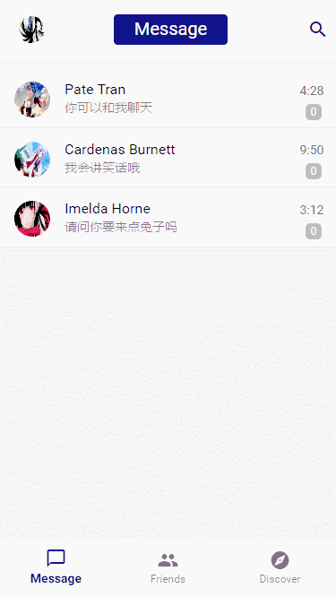
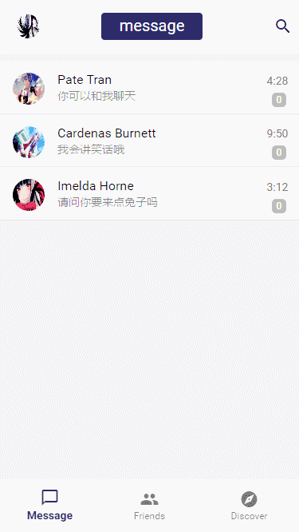
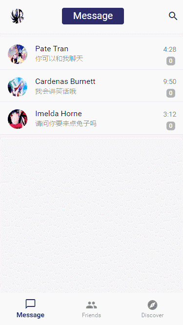
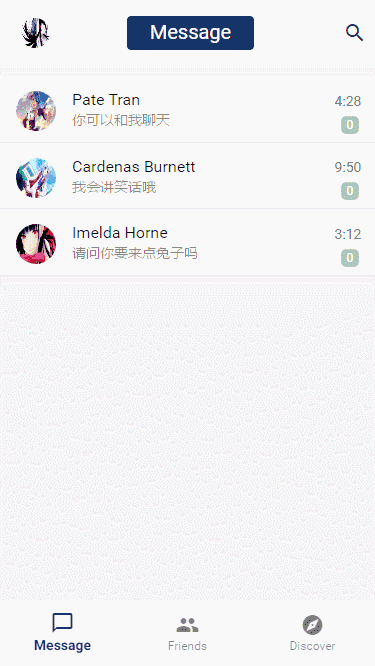
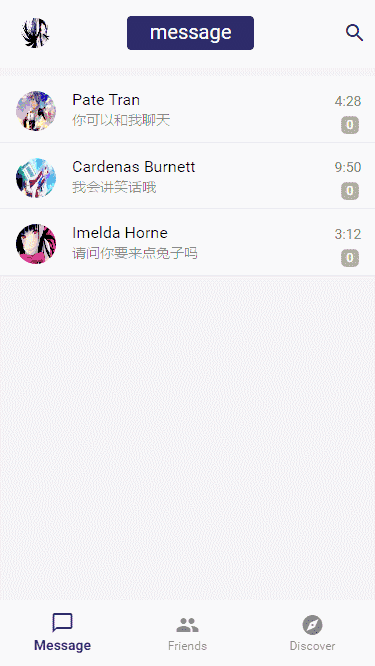

# vue-miniQQ————基于Vue2实现的仿手机QQ单页面应用

## 概述

使用Vue2进行的仿手机QQ的webapp的制作，在ui上，参考了设计师kaokao的作品，作品由个人独立开发，源码中进行了详细的注释。
由于自己也是初学Vue2，所以注释写的不够精简，请见谅。

项目地址 `https://github.com/jiangqizheng/vue-MiniQQ`


## 项目已实现功能

* 对话功能——想着既然是QQ总要能进行对话交流，所以在项目中接入了图灵聊天机器人，可以与列表中的每个人物进行对话。

* 左滑删除——左滑删除相关消息。

* 搜索页面——点击右上角搜索按钮，能够进入搜索页面，输入对应的单词或者数字，动态查找好友。

* 项目中数据流动由vuex进行控制

> 注：对于那句`Flux 架构就像眼镜：您自会知道什么时候需要它。`感觉好像懂了点什么。


## 桌面及移动端测试

* 桌面测试： `npm run dev` 后，打开***开发者工具*** `F12`，模拟手机预览 `Ctrl+Shift+M` (Chrome)
* 移动端测试： `npm run dev` 后，在cmd命令行中输入ipconfig（win）获取到局域网内ip地址后，生成二维码，然后进行测试（建议微信扫二维码）


## 动图预览

gif图好像被压缩的太多了，感兴趣的可以clone后查看。

**侧边栏与个人主页**



**滑动组件的动画效果**



**进入对话框**



**对话框信息**



**首页Tab切换**




***

## 更新说明
> 最近更新说明列表
* 近期都在忙于一些琐事，修复了一小部分因为之前更新至muse-ui新版本导致的显示异常。
* 项目muse-ui已升级至2.0.0，并且优化为单组件加载，精简体积，增加了响应键盘事件，升级ui后出现的小部分问题下次更新就会修复，目前正在整体**重构css样式**，优化移动端的兼容性问题，目的是使视图在各平台上都能够保持一致性
* 对更多内容进行详细的注释，修正了左滑删除的一些错误，现在能够对消息进行正常的左滑删除，然后在朋友列表进行对话就能重新生成聊天队列了（可以删除信息后再继续与机器人进行对话了），另外扩大了删除按钮的宽度

## 问题反馈

建议移步[Issues](https://github.com/jiangqizheng/vue-MiniQQ/issues)，欢迎反馈项目中的不良/错误表现，以及你在开发过程遇到的问题，作者会积极回复。


## 感谢

感谢您的来访 ，如果对于您有帮助 ，麻烦您使劲的给个Star吧 ！ ^_^


## 其他说明

* 由于是抱着边写边学的心态，所以可能会出现些不严谨的地方，或者明显的错误，关于这点，看到请反馈给我，十分感谢。

* 从零到目前的进度，虽然功能简单，但还是花费了不少时间，把项目上传是希望能够对一些同样正在学习Vue的小伙伴有一些帮助。

* 由于是第一次独立的写较为完整的Vue项目，所以希望大家给个Star! Q.o，并且欢迎讨论。

* 此项目会在我Vue的使用过程中不断被完善优化，并且用于测试添加一些新的有趣的功能。

***

## 技术栈

*  vue-cli
*  vue2
*  vue-router
*  vuex
*  axios
*  stylus
*  webpack2
*  muse-ui


### 目录结构

<pre>
.
├── README.md           
├── build                 // 构建服务和webpack配置,转发聊天机器人以及ajax获取用户数据相关内容
├── config                // 项目不同环境的配置
├── dist                  // 项目build目录
├── index.html            // 项目入口文件
├── package.json          // 项目配置文件
├── mockdata.json         // 项目模拟数据
├── src
│   ├── common            // 公用的css样式
│   ├── components        // 各种组件
│   ├── router            // 存放路由的文件夹
│   ├── vuex	            // 存放Vuex的相关
│   ├── muse-ui.config.js // muse-ui单组件加载配置
│   ├── App.Vue           // 模板文件入口
│   └── main.js           // Webpack 预编译入口
├── static                // css js 和图片资源
│   

</pre>


## Build Setup

#### 一个正在制作中的基于vue2全家桶(vue2+vue-router+vuex)的仿QQ项目，移动端webapp，持续更新中·

``` bash
# 安装
npm install

# 运行（端口8888）
npm run dev

# 发布
npm run build
